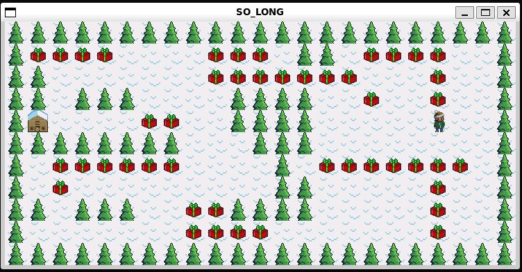

so_long | 42 Berlin

And thanks for all the fish! 🐟

Introduction
In this project, we'll code a simple 2D game to get familiar with the mlx library and UI in general. In my case, it will be a collect the presents game.

Game Rules
The game we choose must follow a set of rules. The executable so_long will receive a map as the only argument, and this map will have a .ber filetype.

The file also must follow these rules:

Only P (player), 1 (wall), 0 (empty), C (collectible), and E (exit) will be accepted characters in our map (except if you add enemies as bonus)
The map must be rectangular, i.e. all rows must have the same length
There must be one exit, one player, and at least one collectible on the map
The map must be closed, i.e. surrounded by walls
If any of these checks fail, the game must end with Error\n followed by a custom message.

The goal is for the player(s) to collect all the collectibles on the map before going to an exit in the least possible number of steps

How it Works
For the graphics part of the project we used a library called minilibx. It's fairly basic and somewhat limited, but was still fun to use in the project.

Part 1: reading the map
In this part of the code I checked that the given map was properly opened, that it had a .ber filetype, and then continued by reading the file one line at a time with get_next_line. Once that was done I filled a struct t_map with some basic map attributes like number of players, exits, collectibles, number of rows and columns, etc. During the reading process I also created a string containing the entire map called str.

Installation
Clone the repo and install the minilibx library by running the config file in the folder if working with linux system.
Then run make and once the executable is created, the game can be launched like
./so_long ./maps/map3.ber
To play the bonus level run make bonus
Enjoy the game 🎅